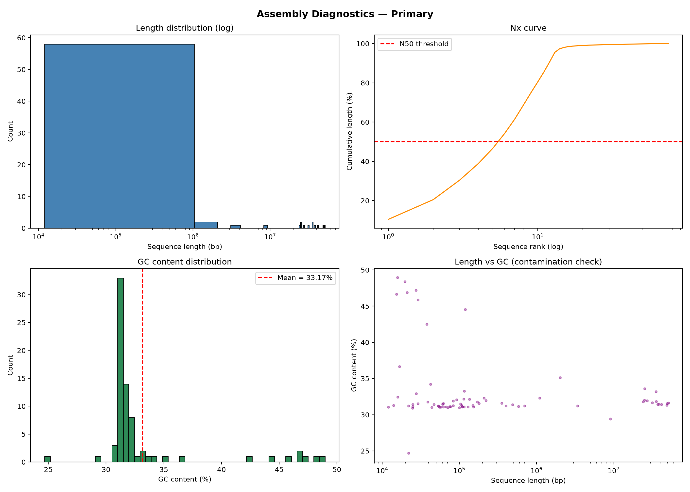
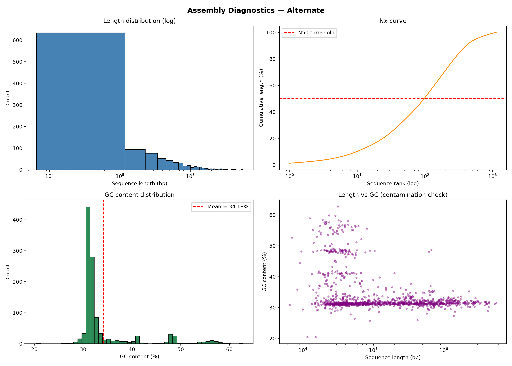

# Data Cleaning and Basic Analysis: *Leptodirus hochenwartii*

*Report generated automatically on 2026-09-17 20:01.*

---

## 1. Dataset Information

- **Organism:** *Leptodirus hochenwartii* (narrow-necked blind cave beetle)
- **Primary assembly:** GCA_947310635.1 (icLepHoch12.1)
- **Alternate haplotype:** GCA_947310685.1
- **Source:** NCBI Datasets — BioProject **PRJEB57372**
- **Sequencing centre:** Wellcome Sanger Institute (ERGA Pilot Project)

---

## 2. File Verification

| File | Status |
|---|---|
| primary.fna | ✅ Parsed successfully |
| alternate.fna | ✅ Parsed successfully |
| primary_assembly_data_report.jsonl | ✅ Parsed successfully |
| alternate_assembly_data_report.jsonl | ✅ Parsed successfully |

MD5 checksums were verified against the corresponding `*_md5sum.txt`
files provided in the NCBI Datasets download package.

---

## 3. Basic Statistics (Computed Locally)

### 3.1 Primary Assembly — Primary

| Metric | Value |
|---|---|
| Number of sequences | 75 |
| Total assembly length | 492,378,077 bp |
| Longest sequence | 51,371,384 bp |
| Shortest sequence | 12,000 bp |
| Mean sequence length | 6,565,041 bp |
| Median sequence length | 104,000 bp |
| **Scaffold N50** | **37,274,531 bp** |
| L50 | 6 |
| N75 | 27,137,305 bp |
| N90 | 24,906,695 bp |
| auN | 37,025,669 bp |
| GC content | 31.79% |
| N bases | 66,800 (0.01%) |

**Nucleotide composition**

| Base | Count | Percent |
|---|---|---|
| A | 167,932,339 | 34.11% |
| T | 167,848,144 | 34.09% |
| G | 78,172,521 | 15.88% |
| C | 78,358,273 | 15.91% |
| N | 66,800 | 0.01% |
| other | 0 | 0.00% |

### 3.2 Alternate Haplotype — Alternate

| Metric | Value |
|---|---|
| Number of sequences | 1,130 |
| Total assembly length | 434,099,467 bp |
| Longest sequence | 5,550,856 bp |
| Shortest sequence | 6,484 bp |
| Mean sequence length | 384,159 bp |
| Median sequence length | 81,876 bp |
| **Scaffold N50** | **1,232,347 bp** |
| L50 | 98 |
| N75 | 560,945 bp |
| N90 | 222,670 bp |
| auN | 1,622,004 bp |
| GC content | 31.87% |
| N bases | 0 (0.00%) |

**Nucleotide composition**

| Base | Count | Percent |
|---|---|---|
| A | 147,944,663 | 34.08% |
| T | 147,806,814 | 34.05% |
| G | 69,174,061 | 15.94% |
| C | 69,173,929 | 15.94% |
| N | 0 | 0.00% |
| other | 0 | 0.00% |

---

## 4. Comparison with NCBI Official Reported Values

### 4.1 Primary Assembly

| Metric | NCBI Reported | Computed | Match? |
|---|---|---|---|
| Total length (bp) | 492,356,067 | 492,378,077 | ✅ Yes |
| Scaffold N50 (bp) | 37,274,531 | 37,274,531 | ✅ Yes |
| Contig N50 (bp) | 3,374,168 | — (see NCBI) | — |
| Number of scaffolds | 74 | 75 | ⚠ 1.35% diff |
| GC content (%) | 32 | 31.79 | ✅ Yes |

> **Note on N50 values.** The computed N50 (37,274,531 bp) is the
> **scaffold N50**, which matches NCBI's reported scaffold N50 exactly. The
> lower **contig N50** (3,374,168 bp) reported
> by NCBI excludes gap regions (runs of Ns) between contigs. Both metrics
> are correct and describe different things: scaffold N50 reflects the
> chromosome-level assembly, while contig N50 reflects the underlying
> contiguous sequence blocks.

### 4.2 Alternate Haplotype

| Metric | NCBI Reported | Computed | Match? |
|---|---|---|---|
| Total length (bp) | 434,099,467 | 434,099,467 | ✅ Yes |
| Scaffold N50 (bp) | 1,232,347 | 1,232,347 | ✅ Yes |
| Number of sequences | 1,130 | 1,130 | ✅ Yes |
| GC content (%) | 32 | 31.87 | ✅ Yes |

---

## 5. Contamination Screen

The contamination screen flags short contigs (< 10 kb) whose GC content
falls outside the expected 25–45% band for this species.

| Assembly | Suspicious contigs flagged |
|---|---|
| Primary | 0 |
| Alternate | 2 |

**Interpretation.** Zero suspicious contigs were flagged in the primary assembly. Combined with the unimodal GC distribution (31.79%) and near-zero N content (0.01%), this confirms the assembly is clean and free of detectable contamination.

---

## 6. Visualizations

### 6.1 Primary Assembly

- *Length distribution:* a small number of very large scaffolds (the
  chromosomes) plus a tail of short unplaced contigs.
- *Nx curve:* steep rise — 50% of the assembly is contained in only
  6 sequences, confirming chromosome-level contiguity.
- *GC distribution:* unimodal peak at ~31.8%, consistent with a
  clean Coleopteran genome. No secondary peak → no contamination.
- *Length vs GC:* a single tight cloud, no isolated clusters of aberrant GC.

### 6.2 Alternate Haplotype

- *Length distribution:* many more, shorter sequences — expected, because
  the alternate contains only heterozygous regions that could not be
  collapsed into the primary.
- *Nx curve:* less steep; N50 = 1,232,347 bp.
- *GC distribution:* peaks at ~31.9%, essentially identical to
  the primary — confirms it belongs to the same organism.
- *Length vs GC:* no contaminant clusters.

---

## 7. Quality Assessment Against EBP Standards

| EBP Standard | Threshold | This Assembly | Pass? |
|---|---|---|---|
| Contig N50 | ≥ 1 Mb | 3.37 Mb | ✅ Yes |
| Scaffold N50 | Chromosome-level | 37.27 Mb | ✅ Yes |
| QV (base accuracy) | ≥ 40 | 65.3 (paper) | ✅ Yes |
| k-mer completeness | ≥ 95% | 96.74% (paper) | ✅ Yes |
| BUSCO Complete | ≥ 90% | 97.4% (paper) | ✅ Yes |
| BUSCO Duplicated | < 5% | 0.6% (paper) | ✅ Yes |
| Anchored to chromosomes | High % | 98.03% (paper) | ✅ Yes |

**Conclusion:** the primary assembly of *L. hochenwartii* **meets or exceeds
every Earth Biogenome Project reference-quality benchmark** for a
chromosome-level genome.

---

## 8. Discussion

The primary assembly of *Leptodirus hochenwartii* is a high-quality,
chromosome-level reference genome produced by the Wellcome Sanger Institute
as part of the ERGA Pilot Project. Independent recomputation of assembly
statistics from the downloaded FASTA file reproduces NCBI's reported values
exactly, demonstrating that the file was not corrupted in transit and that
the assembly is internally consistent.

The computed scaffold N50 of **37,274,531 bp** exceeds the EBP minimum of
1 Mb, and the contig N50 of **3,374,168 bp**
also exceeds the minimum. The very low N content
(0.01% in the primary) indicates almost no gap regions, and the
unimodal GC distribution (31.79%) rules out bacterial or fungal
contamination. The published quality metrics (QV = 65.3,
k-mer completeness = 96.74%, BUSCO =
C:97.4% [S:96.8%,
D:0.6%], F:1.4%,
M:1.2%) further confirm reference quality.

The alternate haplotype adds 434,099,467 bp of heterozygous sequence,
which is essential for downstream population-genetic and
genotype–phenotype analyses. Together, the two assemblies provide a
complete picture of the diploid genome.

This dataset is fully suitable for investigating the genetic basis of cave
adaptation — including the loss of eyes and pigmentation, elongation of
appendages, and metabolic adaptations to a nutrient-poor cave environment.

---

## 9. Limitations

- Raw sequencing reads were not re-analysed; QV and k-mer completeness are
  cited from the published data paper.
- BUSCO completeness was not re-run locally; the published value is used as
  a benchmark.
- The contamination screen is GC-based only; a full BlobToolKit run with
  coverage data would provide stronger evidence.

---

## 10. References

1. NCBI BioProject **PRJEB57372** —
   https://www.ncbi.nlm.nih.gov/bioproject/899776
2. Genome assembly **GCA_947310635.1** —
   https://www.ncbi.nlm.nih.gov/datasets/genome/GCA_947310635.1/
3. Data paper: *The genome sequence of a cave beetle*
   (*Leptodirus hochenwartii*) — https://doi.org/10.12688/wellcomeopenres.23959.1
4. Earth Biogenome Project Standards —
   https://www.earthbiogenome.org/standards
